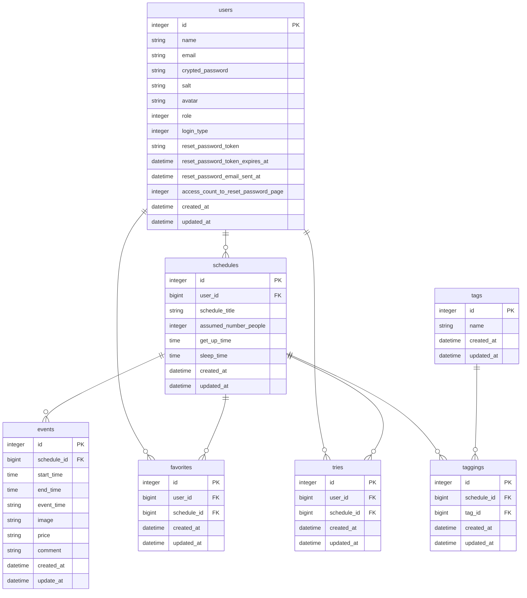

  
サービスURL: https://www.schedule-day-off.com

## **サービス概要**  
---    
休日スケジュールを投稿・共有するサービスです。 様々な価値観を持った人の休日を知ることで、より充実した休日を過ごすためのヒントを得ることができます。
 
 

## **メインのターゲット**  
---  
* 休日の過ごし方をおすすめしたい方  
* 休日の過ごし方に満足していない方  

ユーザーが抱える課題

* 休日をもっと充実させたい  
* Twitter上での交流を増やしたい 

  

解決方法

* 様々な価値観を持った人の一番おすすめの休日スケジュールを共有することで、より休日を充実させるヒントを得ることができる。 
* Twitterと連携することで、交流のきっかけになる。  

 
 

## **主な機能**  
---  
### 未ログインユーザー    
* スケジュールの検索、一覧、詳細  
* ユーザーの詳細  
### ログインユーザー  
* スケジュールの投稿、検索、一覧、詳細、編集  
* ユーザーの編集、詳細  
### 管理ユーザー  
* 全スケジュールの投稿、検索、一覧、詳細、編集、削除  
* 全ユーザーの編集、詳細、削除
 
 

## **なぜこのサービスを作りたいのか？**  
---  
休日をダラダラと過ごしていて、もったいないと考えたのがきっかけ。他人の休日の過ごし方を知ることで自分の休日をより充実させるヒントを得ることができると考えました。
 
 

## **画面遷移図**  
---  
figma: (https://www.figma.com/file/cbWV6ra9ZXM4xS8Fsul06u/schedule-day-off?node-id=0%3A1&t=8jeIEBlmQrI2vLO6-1)
 
 

## **ER図**  
---  

 
 

## **使用技術**  
---  
### バックエンド  
* Ruby 3.1.0  
* Rails 7.0.4  
### フロントエンド  
* hotwire  
* TailwindCSS-daisyUI  
### インフラ  
* Heroku  
* AmazonS3  
* PostgreSQL
 
 

## **スケジュール**  
---  
企画〜技術調査：12/1〆切  
README~ER図作成：12/15〆切  
メイン機能実装：12/15-1/31〆切  
β版をRUNTEQ内リリース(MVP)：1/31〆切  
本番リリース：2/15〆切  